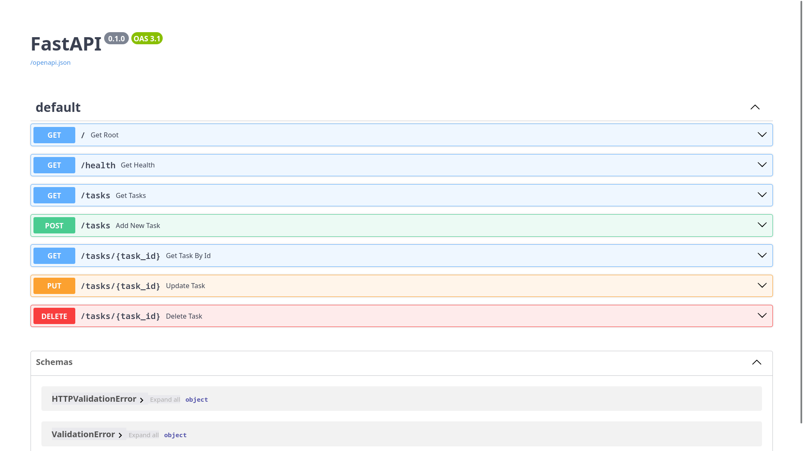

# Task API 

A simple API built with FastAPI that demonstrates basic CRUD for tasks

---

## Features

- API information endpoint
- Health check endpoint
- Get all tasks
- Get a task by ID
- Create a new task
- Update a task
- Delete a task
- Filter tasks by completion status (`GET /tasks?done=true`)
- Search tasks by title (`GET /tasks?search=keyword`)
- View task statistics (`GET /stats`)
- Reset tasks to the default dataset (`POST /reset`)

---

## Prerequisites

- Python 3.10 or newer

--- 

## Installation:

### 1. Clone the repository


```bash
git clone https://github.com/Renz5678/Fast-API-CRUD-for-FlyRank.git
cd Fast-API-CRUD-for-FlyRank
```

### 2. Install dependencies (FastAPI)

```bash
pip install fastapi[standard]
```

### Run the API

```bash
fastapi dev main.py
```

The API will be available at:

```
http://127.0.0.1:8000
```

Swagger Documentation:

```
http://127.0.0.1:8000/docs
```

---

## API Endpoints

| Method | Endpoint | Description |
|--------|----------|-------------|
| GET | `/` | Returns API information |
| GET | `/health` | Returns the server health status |
| GET | `/tasks` | Returns all tasks |
| GET | `/tasks/{task_id}` | Returns a specific task by ID |
| GET | `/tasks?done=true` | Returns only completed tasks |
| GET | `/tasks?done=false` | Returns only incomplete tasks |
| GET | `/tasks?search={keyword}` | Returns tasks whose title contains the specified keyword |
| POST | `/tasks` | Creates a new task |
| PUT | `/tasks/{task_id}` | Updates an existing task |
| DELETE | `/tasks/{task_id}` | Deletes a task |
| GET | `/stats` | Returns task statistics (`total`, `done`, `open`) |
| POST | `/reset` | Resets the task list to the default sample data |
---

## Example Request

### Get all tasks

```bash
curl -i http://127.0.0.1:8000/tasks
```

Example output:

```http
HTTP/1.1 200 OK
content-type: application/json

[
  {
    "id": 1,
    "title": "Household chores",
    "done": true
  },
  {
    "id": 2,
    "title": "Internship Tasks",
    "done": false
  },
  {
    "id": 3,
    "title": "Freelance Website",
    "done": false
  }
]
```

## Swagger UI

API documentation automatically created by FastAPI

accessible through

```
http://127.0.0.1:8000/docs
```

### Screenshot


## Mortality Experiment

After creating several new tasks and restarting the FastAPI server, the newly created tasks disappeared and only the original sample tasks remained. This happens because the application stores its data in memory, so restarting the server recreates the initial task list and discards any changes made while the application was running.
